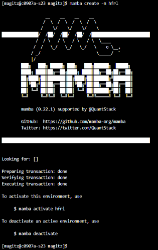
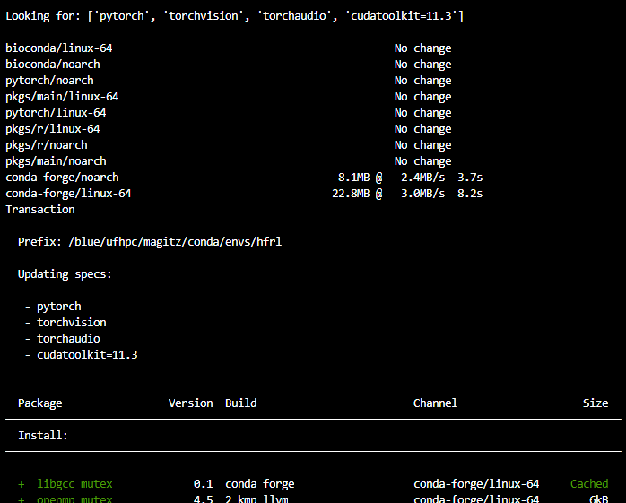
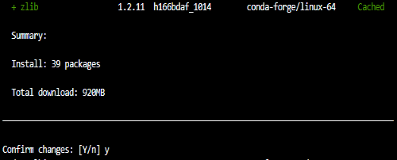
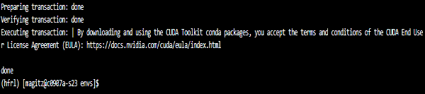
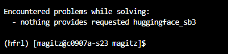
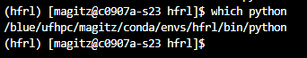

# Conda Environments and Jupyter Kernels

## The problem with `pip install`

While `pip` is easy to use and works for many use cases, there are some major drawbacks. If you have spent any time working in Python, you will likely have seen (and may have run) suggestions to `pip install ____`, or within Jupyter `!pip install ____`, to install this package or that package. That will generally work...up to a point. There are a few issues with doing `pip install`:

1. If you install a version of a package that is also installed in by UFRC (either now or in the future), your version will take precedence. Your version appears in the the `PYTHON_PATH` before the UFRC installed version. That may be fine *now*, but some time down the road there may be a newer version installed by UFRC for compatibility with something else and your older version still takes precedence and breaks the other package. This can be hard to diagnose when things start failing as you have likely forgotten that you installed the package in the first place.
1. You may want to install something that needs a different version of a package. Sometimes, the unfortunate reality is that two packages cannot co-exist because they require different versions of dependencies. This becomes a challenge to manage with `pip` as there isn't a method to swap active versions.
1. `pip` installs **everything** in one locations: `~/.local/lib/python3.X/site-packages/`. All packages installed are in the same location for any given version of Python.

## Conda and Mamba to the rescue!


`conda` and the newer, faster, drop-in replacement `mamba`, were written to solve some of these issues. They allow you to have different environments and switch between environments as needed. They also make it much easier to report the exact configuration of modules that are needed to run some code, facilitating reproducibility.

Check out the [UFRC Help page on conda](https://help.rc.ufl.edu/doc/Conda)

The rest of this tutorial will walk through setting up an environment and then a kenrel to use that environment in Jupyter.

### A caveat

`conda` and `mamba` pull packages from repositories where people post pre-packaged python packages. While there are several available repositories, like the main `conda-forge`, not every Python package is available via `conda`. You may still need to use `pip` to install some things...as noted later, `conda` still helps manage the environment by installing packages within the environment rather than everything in a single folder.

## 1. Edit your `~/.condarc` file

`conda` environments contain all of the packages installed within the environment as well as a Python version. They can quickly grow in size and, especially if you have many environments, fill the 40GB of space provided in your home directory. As such, it is important to change the default and move the storage location from your home directory to your folder in `/blue/`.

To do so, edit or create your `~/.condarc` to use `/blue/group/user/conda/`, replacing `group` with your group name, and `user` with your username. **Note:** This file is in your home directory (`~/`) and hidden (starts with a dot).

One way to do this is to type: `nano ~/.condarc`
If the file is empty, paste in the text below, editing the `env_dirs:` and `pkg_dirs` as below. If the file has contents, update those lines.

 > Your `~/.condarc` should look something like this when you are done editing (again, replacing `group` and `user` in the paths with your group and username):

```bash
channels:
- conda-forge
- bioconda
- defaults
envs_dirs:
- /blue/group/user/conda/envs
pkgs_dirs:
- /blue/group/user/conda/pkgs
auto_activate_base: false
auto_update_conda: false
always_yes: false
show_channel_urls: false
```

## 2. Create your first environment

### 2.1. Load the `conda module`

Before we can run `conda` or `mamba` on HiPerGator, we need to load the `conda` module:

`module load conda`

### 2.2. Create your first environment

To create your first environment, run the following command. In this example, I am creating an environment named `hfrl`

`mamba create -n hfrl`

Here's a screenshot of the output from running that command. Yours should look similar.



> **Note:** You do not need to manually create the folders that you setup in step 1. `mamba` will take care of that for you.

## 3. Activate the new environment

To actiate our environment (whether created with `mamba` or `conda` we use the `conda activate env_name` command. Let's activate our new environment:

`conda activate hfrl`

Notice that your command prompt changes when you activate an environment to indicate which environment is active showing that in parentheses before the other information:

> `(hfrl) [magitz@c0907a-s23 magitz]$ ` 

## 4. Add stuff to our environment with `mamba install`

Now we are ready to start adding things to our environment.

There are a few ways to do this. We can install things one-by-one with either `mamba install ____` or `pip install ____`.

> **Note:** when an environment is active, running `pip install` will install the package *into that environment*. So, even if you continue using `pip`, adding `conda` environments solves the problem of everything being installed in one location--each environment has its own `site-packages` folder and is isolated from other environments.

### 4.1. `mamba install` packages

Now we are ready to install packages using `mamba install ___`.

#### 4.1.1. Start with `cudatoolkit` and `pytorch`/`tensorflow` if using GPU!

**If you plan on using a GPU**, it is important to both make the environment on a node with a GPU (within a Jupyter job for example) and to start by installing the `cudatoolkit` and `pytorch`, `tensorflow` or other frameworks.

> **Note:** if you just `mamba install tensorflow`, you will get a version compiled with an older CUDA, which will be ***extremely*** slow or not recognize the GPU at all...ask me how I know 🤦. Same for `pytorch`.

From the [PyTorch Installation page](https://pytorch.org/get-started/locally/), we should use:

`mamba install pytorch torchvision torchaudio cudatoolkit=11.3 -c pytorch`

When you run that command, `mamba` will look in the repositories for the specified packages and their dependencies. Note we are specifying a particular version of `cudatoolkit`. As of May, 2022, that is the correct version on HiPerGator. Here's a screenshot of part of the output:



`mamba` will list the packages it will install and ask you to confirm the changes. Typing 'y' or hitting return will proceed; 'n' will cancel:



Finally, `mamba` will summarize the results:



### 4.2. Install additional packages

 This tutorial creates an environment for the [Hugging Face Deep Reinforcement Learning Course](https://github.com/huggingface/deep-rl-class), you can either follow along with that or adapt to your needs.

You can list more than one package at a time in the `mamba install` command. We need a couple more, so run:

`mamba install gym-box2d stable-baselines3`

## 5. Add stuff to our environment with `pip install`

As noted above, not everything is available in a `conda` channel. For example the next thing we want to install is `huggingface_sb3`.

If we type `mamba install huggingface_sb3`, we get a message saying nothing provides it:



If we know of a conda source that has that package, we can add it to the `channels:` section of our `~/.condarc` file. That will prompt `mamba` to include that location when searching.

But many things are only available via `pip`. So...

`pip install huggingface_sb3`

That will install `huggingface_sb3`. Again, because we are using environments and have the `hfrl` environment active, `pip` will not install `huggingface_sb3` in our `~/.local/lib/python3.X/site-packages/` directory, but rather within in our `hfrl` directory, at `/blue/group/user/conda/envs/hfrl/lib/python3.10/site-packages`. This prevents the issues and headaches mentioned at the start.

### 5.1. Install additional packages

As with `mamba`, we could list multiple packages in the `pip install` command, but again, we only need one more:

`pip install ale-py==0.7.4`

## 6. Use you kernel from command line or scripts

Now that we have our environment ready, we can use it from the command line or a script using something like:

```bash
module load conda
conda activate hfrl

# Run my amazing python script
python amazing_script.py
```

## 7. Setup a Jupyter Kernel for our environment

Often, we want to use the environment in a Jupyter notebook. To do that, we can create our own Jupyter Kernel.

### 7.1. Add the `jupyterlab` package

In order to use an environment in Jupyter, we need to make sure we install the `jupyterlab` package in the environment:

`mamba install jupyterlab`

### 7.2. Copy the `template_kernel` folder to your path

On HiPerGator, Jupyter looks in two places for kernels when you launch a notebook: 

1. `/apps/jupyterhub/kernels/` for the globally available kernels that all users can use. (Also a good place to look for troubleshooting getting your own kernel going)
1. `~/.local/share/jupyter/kernels` for each user. (Again, your home directory and the `.local` folder is hidden since it starts with a dot)

Copy the `/apps/jupyterhub/template_kernel` folder into your `~/.local/share/jupyter/kernels` directory:

`cp -r /apps/jupyterhub/template_kernel/ ~/.local/share/jupyter/kernels/hfrl`

> **Note:**  This also renames the folder in the copy. It is important that the directory names be distinct in both your directory and the global `/apps/jupyterhub/kernels/` directory.

This repository also has a copy of the HiPerGator [`template_kernel` directory](template_kernel). 

### 7.3. Edit the template_kernel files

The `template_kernel` directory has four files: the `run.sh` and `kernel.json` files will need to be edited in a text editor. We will use `nano` in this tutorial. The `logo-64X64.png` and `logo-32X32.png` are icons for your kernel to help visually distinguish it from others. You can upload icons of those dimensions to replace the files, but they need to be named with those names.

#### 7.3.1. Edit the `kernel.json` file

Let's start editing the `kernel.json` file. As an example, we can use:

` nano ~/.local/share/jupyter/kernels/hfrl/kernel.json`

The template has most of the information and notes on what needs to be updated. Edit the file to look like:

```json
{
 "language": "python",
 "display_name": "HF_Deep_RL",
 "argv": [
  "~/.local/share/jupyter/kernels/hfrl/run.sh",
  "-f",
  "{connection_file}"
 ]
}
```

#### 7.3.2. Edit the `run.sh` file

The `run.sh` file needs the path to the `python` application that is in our environment. The easiest way to get that is to make sure the environment is activated and run the command: `which python`



The path should look something like: `/blue/group/user/conda/envs/hfrl/bin/python`. Copy that path.

Edit the run.sh file with `nano`:

`nano ~/.local/share/jupyter/kernels/hfrl/run.sh `

The file should looks like this, **but with your path**:

```bash
#!/usr/bin/bash

exec /blue/ufhpc/magitz/conda/envs/hfrl/bin/python -m ipykernel "$@"
```
#### 7.3.3. Replace the logos

If you want something more than the generic Python icon, you can place the logos with something else, like these:

 


## 8. Use your kernel!

If you are doing this in a Jupyter session, refresh your page. If not, launch Jupyter.

Your kernel should be there ready for you to use!

