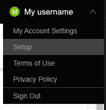

## Pull a container from NCG

### NGC Account

1. You will need an Nvidia Developer account
1. After creating an account, you will need to create an API Token

   * Click on your usename and select Setup 
   * Click on the API 
   * Click the Generate API Key button 
   * Copy and save the API key.
1. Open a terminal on HiPerGator and load the singularity module by typing: `module load singularity`
1. Find the container you want to donwload and copy the pull tag. That string will need some editing. Here's an example using the Riva containter:

Original pull tag: `docker pull nvcr.io/nvidia/riva/riva-speech:2.1.0-server`

Edited pull tag: `singularity pull --docker-login docker://nvcr.io/nvidia/riva/riva-speech:2.1.0-server`

   * Things to change:
      * Replace `docker` with `singularity`
      * Add `--docker-login`
      * Add `docker://` before the nvcr.io URI

 